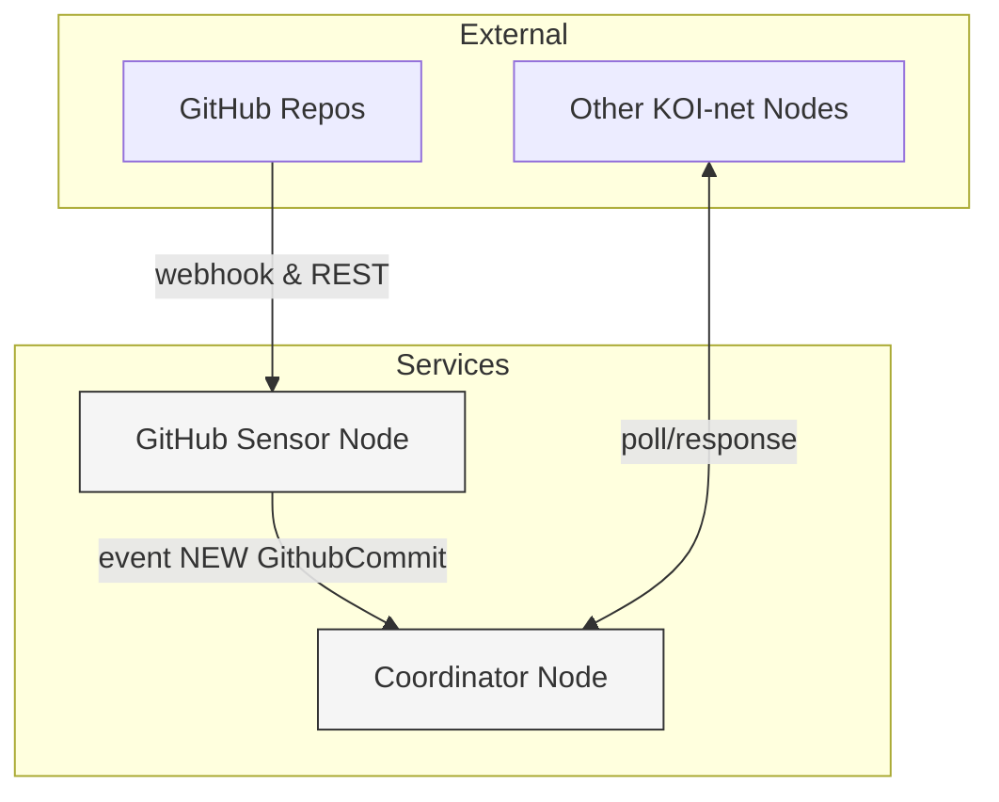

# KOI MCP Demo

[](https://pypi.org/project/koi-mcp-demo/)
[](https://github.com/your-org/koi-mcp-demo/blob/main/LICENSE)
[](https://github.com/your-org/koi-mcp-demo/actions)
[](https://pypi.org/project/koi-mcp-demo/)

Production-ready reference implementation of KOI-net nodes. Includes a Coordinator Node for relaying topology events and a GitHub Sensor Node for streaming commit metadata. Nodes are packaged as FastAPI services for easy deployment.

## Key Features

- Relay KOI-net topology and data events via a dedicated coordinator service.
- Ingest GitHub commits using webhooks or historical back-fill.
- Publish ingested data as standards-compliant `GithubCommit` RIDs.
- Serve node state, manifests, and bundles through FastAPI API endpoints.
- Configure node settings using `.env` files and `pydantic-settings`.

## Architecture Overview



## Installation

### From PyPI

```bash
pip install koi-mcp-demo
```

### From Source

```bash
git clone https://github.com/your-org/koi-mcp-demo.git
cd koi-mcp-demo
python -m venv .venv && source .venv/bin/activate
pip install -e ".[dev]"
```

## Quick Start

To run the included nodes locally:

1.  Source the virtual environment: `.venv/bin/activate`
2.  Create a `.env` file in `services/github/` based on `services/github/.env.example` and
    fill in the required values (`URL`, `FIRST_CONTACT`, `GITHUB_TOKEN`, `GITHUB_WEBHOOK_SECRET`,
    `MONITORED_REPOS`).
3.  Start the Coordinator Node:
    ```bash
    python -m services.coordinator.node &
    ```
4.  Start the GitHub Sensor Node:
    ```bash
    python -m services.github.node
    ```

The nodes will start their FastAPI servers and attempt to connect to each other.

## Core API Usage

Here are examples of using key components from the `koi-net` and `rid-lib` libraries within
the node services:

| API Component                   | Purpose                                       | Example                                                                                                                                                                                                                 |
| :------------------------------ | :-------------------------------------------- | :---------------------------------------------------------------------------------------------------------------------------------------------------------------------------------------------------------------------- |
| `NodeInterface`                 | Bootstrap and manage a KOI-net node lifecycle | `python\nfrom koi_net import NodeInterface\n\nnode = NodeInterface(name="my-node", ...)\nnode.start()\n`                                                                                                                |
| `GithubCommit` (from `rid-lib`) | Resource Identifier for a GitHub commit       | `python\nfrom services.github.node.types import GithubCommit\n\nrid = GithubCommit("octocat", "Hello-World", "a1b2c3")\nprint(rid.html_url)\n# Expected output: https://github.com/octocat/Hello-World/commit/a1b2c3\n` |
| `github_router` (from webhook)  | FastAPI router for handling GitHub webhooks   | `python\nfrom fastapi import FastAPI\nfrom services.github.node.webhook import router as github_router\n\napp = FastAPI()\napp.include_router(github_router)\n`                                                         |

## Command-Line Interface

The main entry points for each node are Python modules:

| Command                               | Description            | Common Flags                      |
| :------------------------------------ | :--------------------- | :-------------------------------- |
| `python -m services.coordinator.node` | Run Coordinator Node   | `--port` (override ENV PORT)      |
| `python -m services.github.node`      | Run GitHub Sensor Node | `--port`, `--host` (override ENV) |

## Configuration & Environment Variables

Node configurations are managed using `pydantic-settings`, reading from environment variables
or `.env` files.

Example `services/github/.env`:

```dotenv
# KOI-net GitHub Node Configuration

# Public URL where this GitHub node can be reached by other KOI-net nodes
URL="http://127.0.0.1:8001"

# URL of the coordinator node or another known KOI-net node
FIRST_CONTACT="http://127.0.0.1:8000/koi-net"

# Host the FastAPI server should listen on (0.0.0.0 allows external connections)
HOST="0.0.0.0"

# Port the FastAPI server should listen on
PORT="8001"

# GitHub Personal Access Token (replace with your own token)
GITHUB_TOKEN="your_github_token_here"

# Secret used to verify webhook signatures (generate a secure random string)
GITHUB_WEBHOOK_SECRET="your_webhook_secret_here"

# Comma-separated list of repositories to monitor (format: owner/repo)
MONITORED_REPOS="owner/repo1,owner/repo2"

# Path to the JSON file storing the last processed commit SHA
STATE_FILE_PATH="state.json"

# Logging level (DEBUG, INFO, WARNING, ERROR, CRITICAL)
# LOG_LEVEL="INFO"
```

Settings are loaded with the following priority: CLI flag > Environment Variable > `.env` file > default value.

## Project Roadmap

- Expand GitHub sensor capabilities (issues, pull requests, etc.).
- Develop additional sensor nodes (e.g., Slack, as partially implemented).
- Implement advanced KOI-net features (e.g., querying the graph, richer event types).
- Improve deployment options and documentation.

## Contributing Guide

See `CONTRIBUTING.md` for detailed guidelines. We follow `black` and `ruff` for code styling,
require Conventional Commits, and use `pytest` for testing. Run `pytest -q` before submitting PRs.

## License

This project is licensed under the MIT License. This permissive license allows for free use,
modification, and distribution. See the [LICENSE](LICENSE) file for details.

## Acknowledgements

Built upon the foundations provided by the `KOI-net` framework, `FastAPI`, `PyGithub`, and `rid-lib`.
